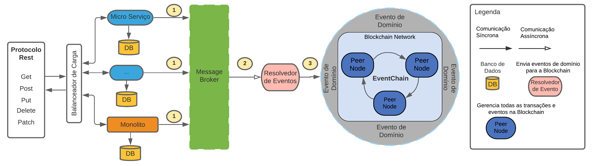

# Eventchain - exemplo-base

Os projetos de exemplo abaixo implementam o conceito básico por trás do estilo arquitetural Eventchain, proposto na dissertação de mestrado em computação aplicada na Unisinos - 2021.

## Arquitetura

## Diagrama de Componentes

## Implementação
Explicação sobre a implementação

|  **Projeto** | **Descrição** | **Implementação** |
| -----------|------------------------------|----------|
| [auth-service](auth-service) | Implementa um componente de autenticação que gera tokens JWT para permitir a autenticação ao acessar os demais serviços disponibilizados.| Java, Spring-boot |
| [commons-auth](commons-auth) | Implementa uma uma biblioteca que valida se as requisições possuem uma autenticação válida. Importada por todos os projetos disponibilizam um serviço REST para comunicação.| Java, Spring-boot |
| [account-service](account-service) | Implementa um serviço protótipo para contas transacionais. | Java, Spring-boot  |
| [loan-service](loan-service) | Implementa um serviço protótipo empréstimos. | Java, Spring-boot  |
| [event-resolver](event-resolver) | Implementa um serviço que possui a capacidade de descobrir de transformar eventos de domínio em eventos de negócio, ou seja, transformar um ou mais eventos de mais baixa em ordem em eventos de mais alta ordem. | Java, Spring-boot, [Ksql DB](https://ksqldb.io/)| 
| [event-chaincode-javascript](event-chaincode-javascript) | Implementa os Smart Contracts responsáveis para interagir com a Blockchain. | Javascript | 
