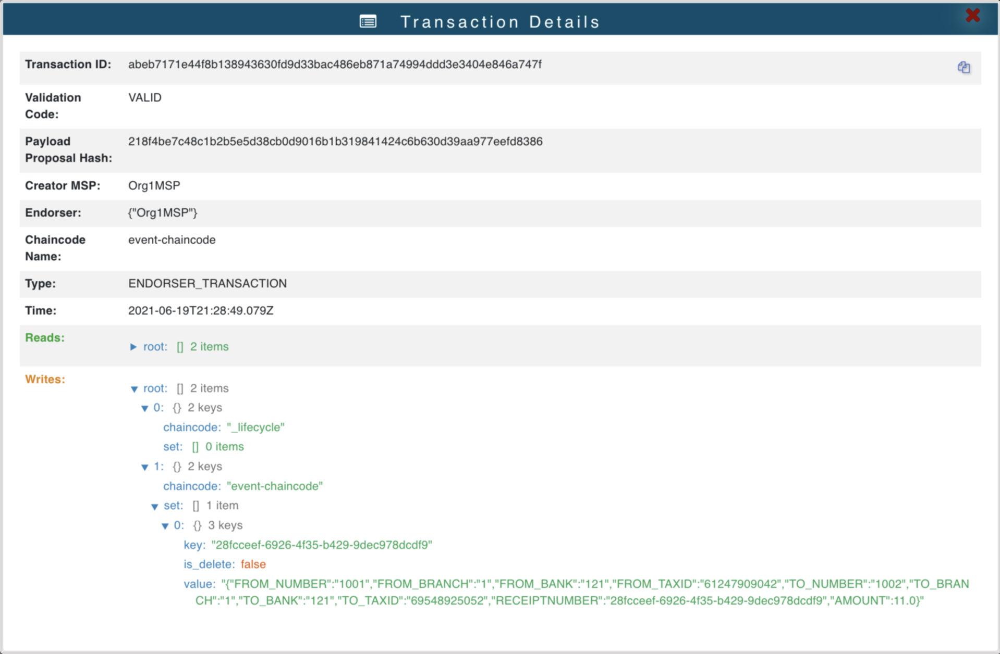

# event-chaincode-javascript
Implementa os chaincodes (Smart Contracts) que escrevem na Blockchain os eventos gerados pelo [event-resolver](../event-resolver).

## Exemplo de JSON armazenado na Blockchain 

### json de um evento resolvida como uma transferência
```json
{
  "FROM_NUMBER":"1001",
  "FROM_BRANCH":"1",
  "FROM_BANK":"121",
  "FROM_TAXID":"61247909042",
  "TO_NUMBER":"1002",
  "TO_BRANCH":"1",
  "TO_BANK":"121",
  "TO_TAXID":"69548925052",
  "RECEIPTNUMBER":"28fcceef-6926-4f35-b429-9dec978dcdf9",
  "AMOUNT":11.0
}
```

### Json armazendo na Blockchain
