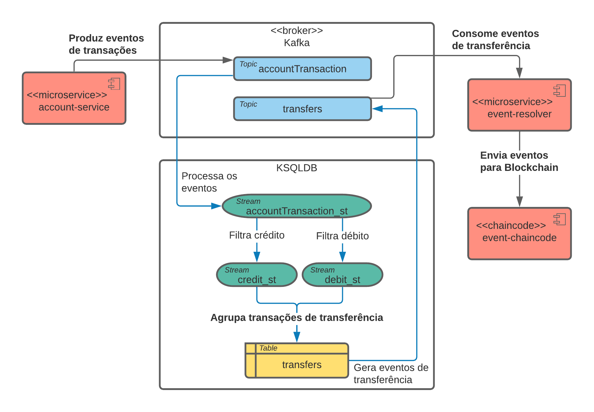

# Event-resolver

O even-resolver tem a função de identificar os os eventos de mais baixa ordem gerados pelas aplicações e transformar esses eventos de mais alta ordem. 
Dessa forma as aplicações geradoras de eventos não precisam implementar regras específicas para cada evento.

Ao transformar os eventos de baixa em ordem em eventos de alta ordem, o event-resolver gera eventos com mais valor de negócio. Todos os eventos de alta ordem são registrados na Blockchain, 
garantindo assim imutabilidade e o valor da informação. 

## Implementação do protótipo e dependências
Para acelerar e facilitar a construção do protótipo, o event-resolver é composto por dois componenentes: ksqldb e um microsserviço. 

- O ksqldb implementa a lógica de processar e agregar as informações.
- O microsserviço consome os eventos processados, entende os eventos e os direciona para o smart contract específico na Blockchain.

### Componentes
- Microsserviço [account-service](../account-service) gera eventos de transações financeiras do tipo débito e crédito e as envia para o broker de mensagens.
- A implementação do broker escolhida para o protótipo é o Kafka, ele recebe as mensagens em um tópico específico.
- O event-resolver utiliza o ksqldb para processar, filtrar os eventos de baixa ordem e agregar os eventos de mais alta ordem em outro tópico. Na sequência um microsserviço especialista consome 
os eventos de mais alta ordem e os envia para a Blockchain ([event-chaincode-javascript](../event-chaincode-javascript)).

